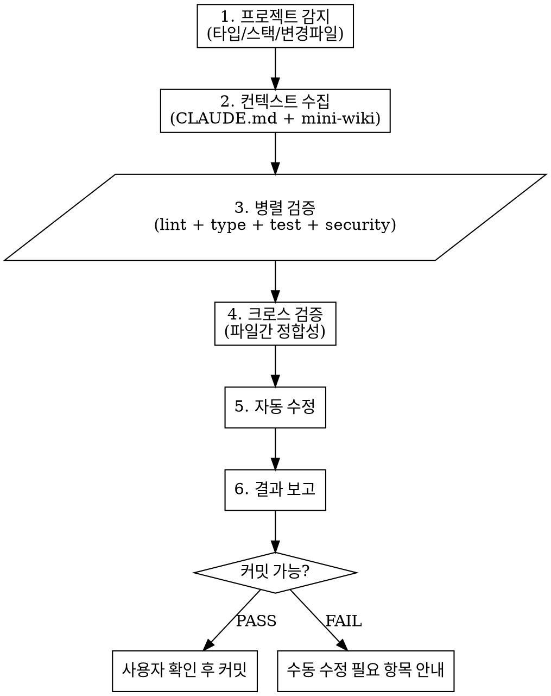

# Pre-Commit Verify

**Input**: $ARGUMENTS (프로젝트 경로, 기본값: CWD)

커밋 전 에이전트 팀이 프로젝트를 검증하고, 수정 가능한 오류는 자동 수정합니다.

## 워크플로우



## 에이전트 팀

| 에이전트 | 역할 | 실행 순서 |
|----------|------|-----------|
| context-gatherer | 프로젝트 설정/위키/CLAUDE.md 수집 | 1단계 (foreground) |
| lint-checker | 린트/포맷 검사 + 자동 수정 | 2단계 (background) |
| type-checker | 타입 체크 (TS/Python) | 2단계 (background) |
| test-runner | 테스트 실행 + 결과 분석 | 2단계 (background) |
| security-scanner | 보안 취약점/민감정보 스캔 | 2단계 (background) |
| cross-validator | 파일간 정합성/미사용 코드 검증 | 3단계 (foreground) |

## 1단계: 프로젝트 감지

### 변경 파일 수집

```bash
# staged 파일 (커밋 대상)
git diff --cached --name-only --diff-filter=ACMR

# unstaged 포함 전체 변경
git diff --name-only HEAD
```

### 프로젝트 타입 감지

| 파일 | 타입 | 검증 도구 |
|------|------|-----------|
| `package.json` + `tsconfig.json` | Node/TypeScript | tsc, eslint, vitest/jest |
| `package.json` (only) | Node/JavaScript | eslint, jest |
| `pyproject.toml` or `requirements.txt` | Python | ruff, mypy, pytest |
| `pubspec.yaml` | Flutter/Dart | flutter analyze, flutter test |
| `*.xcodeproj` or `Package.swift` | Swift/iOS | swiftlint, xcodebuild test |
| `build.gradle*` | Kotlin/Java | ktlint, gradle test |
| `go.mod` | Go | golangci-lint, go test |

**모노레포**: `packages/` 또는 `apps/` 하위에 여러 타입이 존재할 수 있음 → 변경된 패키지만 검증.

## 2단계: 컨텍스트 수집 (context-gatherer)

foreground 에이전트로 실행. 수집 대상:

1. **CLAUDE.md** — 프로젝트별 코딩 규칙, 테스트 정책
2. **mini-wiki** — 프로젝트 관련 위키 문서 검색 (`search_wiki` tool)
3. **package.json scripts** — 사용 가능한 lint/test/build 명령어
4. **기존 설정 파일** — `.eslintrc`, `tsconfig.json`, `ruff.toml`, `biome.json` 등

수집 결과를 각 검증 에이전트에 컨텍스트로 전달.

### context-gatherer 프롬프트 템플릿

```
프로젝트 '{project_path}'의 커밋 전 검증을 위해 컨텍스트를 수집하라.

1. CLAUDE.md 읽기 (있으면)
2. mini-wiki에서 프로젝트명으로 검색 (search_wiki)
3. package.json의 scripts 섹션 확인 (lint, test, build, typecheck 등)
4. 린터/포맷터 설정 파일 확인
5. 테스트 프레임워크 확인 (vitest.config, jest.config, pytest.ini 등)

결과를 JSON으로 반환:
{
  "project_type": "node-ts | python | flutter | swift | ...",
  "lint_cmd": "npm run lint | ruff check . | ...",
  "test_cmd": "npm test | pytest | ...",
  "type_cmd": "npx tsc --noEmit | mypy . | ...",
  "build_cmd": "npm run build | ...",
  "fix_cmd": "npm run lint -- --fix | ruff check . --fix | ...",
  "conventions": ["CLAUDE.md에서 추출한 규칙들"],
  "wiki_context": ["관련 위키 내용 요약"]
}
```

## 3단계: 병렬 검증

context-gatherer 결과를 기반으로 4개 에이전트를 **동시에 background로** 실행.

### lint-checker

```
프로젝트 '{project_path}'의 린트/포맷 검사를 수행하라.

실행할 명령어: {lint_cmd}
자동 수정 명령어: {fix_cmd}

절차:
1. 린트 검사 실행
2. 오류 발견 시 자동 수정 명령어 실행
3. 재검사하여 잔여 오류 확인
4. 결과 반환: { fixed: [...], remaining: [...] }
```

### type-checker

```
프로젝트 '{project_path}'의 타입 검사를 수행하라.

실행할 명령어: {type_cmd}

절차:
1. 타입 체크 실행
2. 오류를 파일:라인 단위로 정리
3. 자동 수정 가능한 오류 식별 (missing import, unused variable 등)
4. 수정 가능한 것은 Edit tool로 수정
5. 결과 반환: { fixed: [...], remaining: [...] }
```

### test-runner

```
프로젝트 '{project_path}'의 테스트를 실행하라.

실행할 명령어: {test_cmd}

절차:
1. 변경된 파일 관련 테스트만 실행 (가능한 경우)
2. 실패 테스트 원인 분석
3. 테스트 코드 자체의 문제 vs 구현 코드의 문제 구분
4. 결과 반환: { passed: N, failed: N, failures: [{test, reason, fixable}] }

주의: 테스트 코드를 수정하지 말 것. 구현 코드의 문제만 수정 가능.
```

### security-scanner

```
프로젝트 '{project_path}'의 보안 검사를 수행하라.

검사 항목:
1. 민감 정보 노출 (API 키, 비밀번호, 토큰이 코드에 하드코딩)
   - git diff --cached 에서 패턴 검색: /(?:api[_-]?key|secret|password|token)\s*[:=]\s*['"][^'"]+/i
2. .env 파일이 staged에 포함되었는지 확인
3. .gitignore 누락 체크 (node_modules, .env, __pycache__, .DS_Store)
4. 의존성 취약점 (npm audit / pip audit 사용 가능시)

결과 반환: { critical: [...], warning: [...] }

critical 발견 시 커밋 차단 권고.
```

## 4단계: 크로스 검증 (cross-validator)

2단계 에이전트들의 결과를 모두 취합한 뒤, foreground로 실행.

```
프로젝트 '{project_path}'의 크로스 파일 검증을 수행하라.

이전 에이전트 결과:
- lint: {lint_result}
- type: {type_result}
- test: {test_result}
- security: {security_result}

추가 검증:
1. 변경 파일 간 import/export 정합성
2. 삭제된 함수를 다른 파일에서 아직 참조하는지
3. 환경 변수 사용과 .env.example 동기화
4. 자동 수정된 내용이 다른 검사를 깨트리지 않았는지 재확인

최종 결과 반환: { pass: bool, summary: "...", issues: [...] }
```

## 5단계: 자동 수정 요약

각 에이전트가 수정한 내용을 취합하여 사용자에게 보여줌.

```
## 자동 수정 내역

### lint-checker
- src/utils.ts:15 — trailing comma 추가
- src/api.ts:42 — unused import 제거

### type-checker
- src/types.ts:8 — missing return type 추가

### 수정 불가 (수동 확인 필요)
- test-runner: src/auth.test.ts FAIL — login() 반환값 타입 불일치
- security: src/config.ts:12 — API_KEY 하드코딩 의심
```

## 6단계: 결과 보고

### 출력 형식

```
## Pre-Commit Verify Report

### 프로젝트: creator-marketplace/backend (Node/TypeScript)
### 변경 파일: 12개

┌──────────────────┬────────┬──────────┬──────────────┐
│     검증 항목     │ 결과   │ 자동수정  │ 잔여 이슈     │
├──────────────────┼────────┼──────────┼──────────────┤
│ Lint/Format      │ ⚠️ FIX │ 3건 수정  │ 0건          │
│ Type Check       │ ✅ PASS │ 1건 수정  │ 0건          │
│ Tests            │ ❌ FAIL │ —        │ 2건 실패      │
│ Security         │ ✅ PASS │ —        │ 0건          │
│ Cross-Validation │ ✅ PASS │ —        │ 0건          │
└──────────────────┴────────┴──────────┴──────────────┘

### 판정: ⚠️ 테스트 실패 2건 — 수동 확인 필요

실패 테스트:
1. auth.test.ts > login should return JWT — TypeError: expected string
2. user.test.ts > create user validation — assertion failed
```

## 판정 기준

| 조건 | 판정 |
|------|------|
| 모든 검증 PASS (자동수정 포함) | ✅ COMMIT READY |
| 린트/타입만 자동수정, 테스트 PASS | ✅ COMMIT READY |
| 테스트 실패 있음 | ⚠️ 수동 확인 필요 |
| security critical 발견 | ❌ 커밋 차단 권고 |
| .env 파일 staged | ❌ 커밋 차단 권고 |

## 커밋 처리

**반드시 사용자 확인 후 커밋.** 자동 커밋 절대 금지.

- ✅ COMMIT READY → "커밋해도 될까요?" 확인 후 진행
- ⚠️ 수동 확인 → 이슈 목록 제시, 사용자 판단 대기
- ❌ 차단 → 해결 방법 안내, 커밋 진행하지 않음

## 모노레포 처리

변경된 파일의 경로에서 패키지를 식별:

```bash
# 변경 파일에서 패키지 추출
git diff --cached --name-only | sed 's|/.*||' | sort -u
# 모노레포: packages/xxx/, apps/xxx/ 패턴
git diff --cached --name-only | grep -oE '^(packages|apps)/[^/]+' | sort -u
```

각 패키지별로 독립적으로 검증 실행. 패키지 간 의존성은 cross-validator에서 확인.

## 자주 하는 실수

- `npm test`가 watch 모드로 실행됨 → `CI=true npm test` 또는 `npx vitest run` 사용
- Python venv 미활성화 상태에서 실행 → 프로젝트 내 `.venv/bin/python` 경로 직접 사용
- Flutter 프로젝트에서 `flutter test`가 느림 → 변경 파일 관련 테스트만 지정
- 대규모 프로젝트에서 전체 타입체크가 느림 → `tsc --noEmit` 대신 변경 파일만 `tsc --noEmit [files]`
